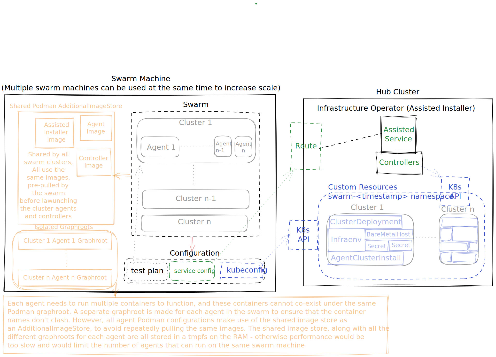

# ! Warning !
Although the code in this repo tries its best to be non-destructive, it has a big potential
to mess up the machine it's running on - so you should probably run it in a disposable VM.

# What is this
This is a tool to launch a swarm of asssisted installer agents (and their corresponding cluster CRs)
that look to the service like actual cluster host agents, all the way from discovery/bmh to completed
installation and controller progress reports, for the purpose of load-testing the service. This is made 
possible by utilizing the dry-run mode of the agent/installer/controller.

# Background
Originally, the assisted installer service has been load-tested by installing actual clusters
on thousands of VMs. That approach has the advantage of testing the real thing - complete e2e OCP
assisted installation - it gave a perfectly accurate representation of the load on the service and also
helped find rare installation bugs. However, using this method is very costly and requires a
lot of machines to host all these VMs. Since this amount of hardware is not always immediately
available, a need arose to find a cheaper, less hardware-intensive way to load test
the service, by faking agent traffic rather then performing actual installations. This has the 
obvious downside that it doesn't find actual rare installation bugs, but at-least it allows us
to check how the service handles a lot of seemingly real agent traffic.

I considered two approaches to fake agent traffic:

1. Complete emulation - using tools such as JMeter or Locust, or writing custom fake agents that
 behave like real one, then running a lot of those on a single machine. 

2. No-op agent - use the existing agent, as is, let it do everything it usually does - but replace
 destructive actions such as installation, disk wiping, etc. with no-ops. The assisted controller that runs
 on the cluster (the cluster which doesn't really exist in this case) will simply run locally, and will
 also be modified to use mocked kube-api calls that cause it to feel like it's running on an 
 actual cluster.

Option (1) is definitely possible, but I felt it would be hard to maintain it and keep it up to date
with all the API changes / agent behavior changes that will be added in the future. 

Option (2) is what this repo is. Originally this repo contained the patches to make the agent/installer/controller no-op,
but today the patches have been upstreamed and now the agent/installer/controller have a "dry run" mode that 
does exactly that, and this repo makes use of that

# Architecture



# TODO
- [ ] Run with auth enabled (load testing without auth is a bit unfair - I presume it adds a lot of CPU usage)
- [ ] Query prometheus, extract interesting metrics (graphana dashboards? matplotlib?)
- [ ] AI SaaS clusters (currently only kube-api is supported)

# Usage
1. Launch a kube-api assisted service on your cluster. This part is up to you. Make sure the service is accessible from the machine running the swarm.
2. Configure the service -
    - `AUTH_TYPE` set to `none`
    - `SKIP_CERT_VERIFICATION` set to `"true"`
    - `HW_VALIDATOR_REQUIREMENTS` can optionally be modified if your swarm machine has less RAM/Storage then is required by default
3. See "Getting rid of CBO on OpenShift section below"
4. On the swarm machine, install the packages in `requirements.txt` and make sure you have `kubectl` and `oc` binaries in your `PATH`.
5. Prepare a test plan - see `testplan.example.yaml`
6. Prepare a service config file - see `service_config.example.yaml`
7. Install `requirements.txt` - `python3 -m pip install -r requirements.txt`
8. Ensure you're using a fairly modern version of podman (3.4 or later)
9. Use sudo to run `./main.py`, for example, to run with the example configurations and `KUBECONFIG` at `/path/to/kubeconfig`, run:

`sudo KUBECONFIG=/path/to/kubeconfig ./main.py 200 testplan.example.yaml service_config.example.yaml`

# Getting rid of CBO on OpenShift
If you're running CBO on your hub cluster, you'd have to scale it down to 0 so it won't interfere with
the swarm's BMH simulation.

1. Set cluster-baremetal-operator to unmanaged, so CVO doesn't fight us when we later try to scale it down -
```bash
$ cat <<EOF >cbo-patch.yaml
- op: add
  path: /spec/overrides
  value:
  - kind: Deployment
    group: apps
    name: cluster-baremetal-operator
    namespace: openshift-machine-api
    unmanaged: true
EOF
$ oc patch clusterversion version --type json -p "$(cat cbo-patch.yaml)"
```

2. Scale the bare metal operator deployment to `0`
```bash
$ oc scale deployment/cluster-baremetal-operator -n openshift-machine-api --replicas=0
```

3. Scale the metal3 deployment to `0`
```bash
$ oc scale deployment/metal3 -n openshift-machine-api --replicas=0
```

4. Remove baremetal-operator webhook
```bash
$ oc delete validatingwebhookconfiguration baremetal-operator-validating-webhook-configuration
```
